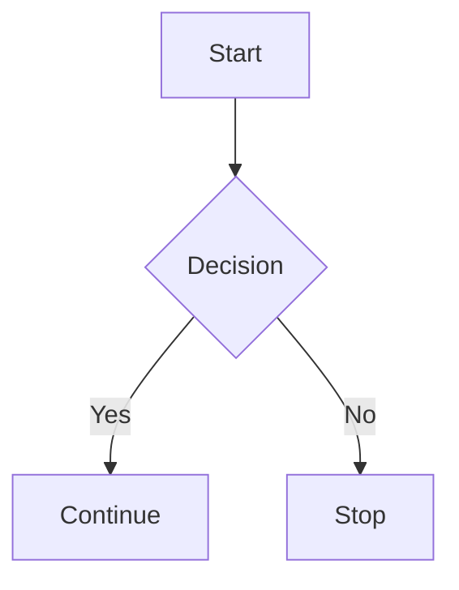

# Mermaid Test

This is a quick test of Mermaid rendering in CPC's MarkdownViewer.

## Flowchart



## Regular code block (should stay as code)

```js
const hello = "world";
console.log(hello);
```

Done.
