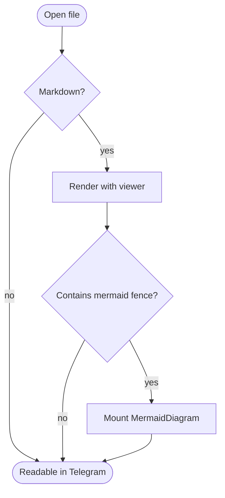

# Mermaid Preview Fixture

Current production output parses mermaid as a fenced code block first; the
viewer then replaces `code.language-mermaid` with a React-rendered diagram. This
fixture pins the parser-level baseline that Wave 2 must account for.

Text after the diagram should remain a separate paragraph.

