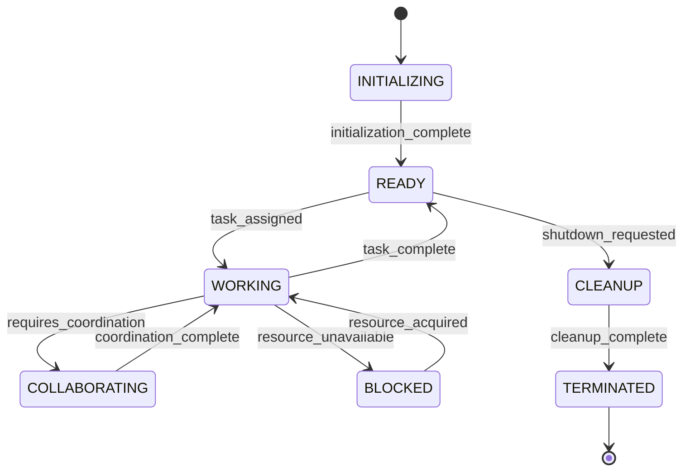
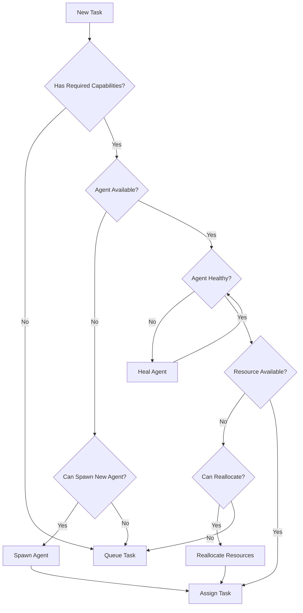

# Agent Orchestration Documentation

## Overview

This document provides comprehensive guidance for LLM agents and orchestration systems managing multi-agent development environments in the Claude Pocket Console project. All instructions are designed for programmatic execution by AI systems.

## Table of Contents

1. [Agent Lifecycle Management](#agent-lifecycle-management)
2. [Resource Allocation Algorithms](#resource-allocation-algorithms)
3. [Git Workflow Coordination](#git-workflow-coordination)
4. [Communication Protocols](#communication-protocols)
5. [Monitoring and Health Management](#monitoring-and-health-management)
6. [Security and Isolation](#security-and-isolation)
7. [Error Handling and Recovery](#error-handling-and-recovery)
8. [Integration Specifications](#integration-specifications)

## Agent Lifecycle Management

### Agent States

```json
{
  "states": {
    "INITIALIZING": "Agent is being created and configured",
    "READY": "Agent is ready to accept tasks",
    "WORKING": "Agent is actively executing tasks",
    "COLLABORATING": "Agent is coordinating with other agents",
    "BLOCKED": "Agent is waiting for resources or dependencies",
    "CLEANUP": "Agent is releasing resources",
    "TERMINATED": "Agent has completed lifecycle"
  }
}
```

### State Transition Rules



### Agent Creation Protocol

```bash
# Step 1: Allocate resources
AGENT_ID=$(uuidgen)
WORKSPACE="/workspace/agents/${AGENT_ID}"
mkdir -p "${WORKSPACE}"

# Step 2: Initialize git workspace
cd "${WORKSPACE}"
git clone https://github.com/claudes-world/claude-pocket-console.git .
git checkout -b "agent-${AGENT_ID}"

# Step 3: Configure agent environment
cat > .agent-config.json <<EOF
{
  "agentId": "${AGENT_ID}",
  "createdAt": "$(date -u +%Y-%m-%dT%H:%M:%SZ)",
  "capabilities": ["code", "test", "deploy"],
  "resourceLimits": {
    "cpu": "2",
    "memory": "4Gi",
    "storage": "10Gi"
  }
}
EOF

# Step 4: Register agent with orchestrator
curl -X POST http://orchestrator:8080/agents/register \
  -H "Content-Type: application/json" \
  -d @.agent-config.json
```

### Agent Task Assignment Algorithm

```python
def assign_task_to_agent(task, available_agents):
    """
    Deterministic task assignment algorithm
    """
    # Step 1: Filter capable agents
    capable_agents = [
        agent for agent in available_agents
        if task.required_capabilities.issubset(agent.capabilities)
    ]
    
    # Step 2: Calculate agent scores
    agent_scores = []
    for agent in capable_agents:
        score = calculate_agent_score(agent, task)
        agent_scores.append((agent, score))
    
    # Step 3: Select optimal agent
    if not agent_scores:
        return None
    
    optimal_agent = max(agent_scores, key=lambda x: x[1])[0]
    return optimal_agent

def calculate_agent_score(agent, task):
    """
    Score calculation based on multiple factors
    """
    score = 0
    
    # Current workload (inverse relationship)
    score += (1 - agent.current_load) * 40
    
    # Specialization match
    score += len(task.tags.intersection(agent.specializations)) * 20
    
    # Recent success rate
    score += agent.success_rate * 30
    
    # Resource availability
    score += agent.available_resources_ratio * 10
    
    return score
```

## Resource Allocation Algorithms

### Port Allocation

```json
{
  "portRanges": {
    "development": {
      "start": 3000,
      "end": 3999,
      "allocation": "sequential"
    },
    "testing": {
      "start": 4000,
      "end": 4999,
      "allocation": "random"
    },
    "services": {
      "start": 8000,
      "end": 8999,
      "allocation": "fixed",
      "assignments": {
        "orchestrator": 8080,
        "monitoring": 8081,
        "metrics": 8082
      }
    }
  }
}
```

### Port Allocation Algorithm

```bash
#!/bin/bash
# allocate_port.sh

allocate_port() {
    local PURPOSE=$1
    local AGENT_ID=$2
    
    case $PURPOSE in
        "development")
            # Sequential allocation
            LAST_PORT=$(redis-cli GET "last_dev_port" || echo "2999")
            NEXT_PORT=$((LAST_PORT + 1))
            if [ $NEXT_PORT -gt 3999 ]; then
                echo "ERROR: No available development ports" >&2
                return 1
            fi
            redis-cli SET "last_dev_port" $NEXT_PORT
            redis-cli SET "port:${NEXT_PORT}:agent" $AGENT_ID
            echo $NEXT_PORT
            ;;
        "testing")
            # Random allocation with collision detection
            while true; do
                PORT=$((RANDOM % 1000 + 4000))
                if ! redis-cli EXISTS "port:${PORT}:agent" | grep -q "1"; then
                    redis-cli SET "port:${PORT}:agent" $AGENT_ID
                    echo $PORT
                    break
                fi
            done
            ;;
    esac
}
```

### Container Resource Limits

```yaml
# docker-compose.agent.yml
version: '3.8'

services:
  agent-${AGENT_ID}:
    image: claude-pocket-console:agent
    container_name: agent-${AGENT_ID}
    environment:
      - AGENT_ID=${AGENT_ID}
      - WORKSPACE=/workspace
    volumes:
      - agent-workspace-${AGENT_ID}:/workspace
    deploy:
      resources:
        limits:
          cpus: '2.0'
          memory: 4G
        reservations:
          cpus: '1.0'
          memory: 2G
    security_opt:
      - no-new-privileges:true
    read_only: true
    tmpfs:
      - /tmp
      - /var/run
```

## Git Workflow Coordination

### Branch Management Protocol

```bash
#!/bin/bash
# git_workflow.sh

create_feature_branch() {
    local ISSUE_NUMBER=$1
    local AGENT_ID=$2
    local BRANCH_NAME="feat/${ISSUE_NUMBER}-${AGENT_ID}"
    
    # Ensure clean state
    git stash push -m "Auto-stash by agent ${AGENT_ID}"
    
    # Update main branch
    git checkout main
    git pull origin main
    
    # Create feature branch
    git checkout -b "$BRANCH_NAME"
    
    # Register branch ownership
    echo "${AGENT_ID}" > .git/branch-owner
    
    # Push branch with tracking
    git push -u origin "$BRANCH_NAME"
}

coordinate_merge() {
    local SOURCE_BRANCH=$1
    local TARGET_BRANCH=$2
    local AGENT_ID=$3
    
    # Lock mechanism to prevent conflicts
    LOCK_KEY="merge:${TARGET_BRANCH}"
    
    # Acquire lock with timeout
    if ! redis-cli SET "$LOCK_KEY" "$AGENT_ID" NX EX 300; then
        echo "ERROR: Merge lock held by another agent" >&2
        return 1
    fi
    
    # Perform merge
    git checkout "$TARGET_BRANCH"
    git pull origin "$TARGET_BRANCH"
    git merge --no-ff "$SOURCE_BRANCH" -m "Merge ${SOURCE_BRANCH} into ${TARGET_BRANCH} [Agent: ${AGENT_ID}]"
    
    # Push changes
    git push origin "$TARGET_BRANCH"
    
    # Release lock
    redis-cli DEL "$LOCK_KEY"
}
```

### Conflict Resolution Algorithm

```python
def resolve_merge_conflicts(conflict_files, agent_context):
    """
    Automated conflict resolution with fallback strategies
    """
    resolution_log = []
    
    for file_path in conflict_files:
        conflict_data = parse_conflict_markers(file_path)
        
        # Strategy 1: Semantic merge
        if can_merge_semantically(conflict_data):
            resolution = semantic_merge(conflict_data)
            apply_resolution(file_path, resolution)
            resolution_log.append({
                "file": file_path,
                "strategy": "semantic_merge",
                "success": True
            })
            continue
        
        # Strategy 2: Prefer newer changes
        if conflict_data["timestamps_available"]:
            resolution = prefer_newer_changes(conflict_data)
            apply_resolution(file_path, resolution)
            resolution_log.append({
                "file": file_path,
                "strategy": "prefer_newer",
                "success": True
            })
            continue
        
        # Strategy 3: Request human intervention
        create_review_request(file_path, conflict_data)
        resolution_log.append({
            "file": file_path,
            "strategy": "human_review_required",
            "success": False
        })
    
    return resolution_log
```

## Communication Protocols

### Micro-blogging Format

```json
{
  "messageSchema": {
    "type": "object",
    "required": ["agentId", "timestamp", "content", "context"],
    "properties": {
      "agentId": {
        "type": "string",
        "pattern": "^[a-f0-9]{8}-[a-f0-9]{4}-[a-f0-9]{4}-[a-f0-9]{4}-[a-f0-9]{12}$"
      },
      "timestamp": {
        "type": "string",
        "format": "date-time"
      },
      "content": {
        "type": "string",
        "maxLength": 280
      },
      "context": {
        "type": "object",
        "properties": {
          "issueNumber": {"type": "integer"},
          "taskId": {"type": "string"},
          "phase": {"type": "string"}
        }
      },
      "signature": {
        "type": "string",
        "pattern": "^-- .+ Agent .+$"
      }
    }
  }
}
```

### GitHub Issue Update Protocol

```bash
#!/bin/bash
# github_update.sh

post_issue_update() {
    local ISSUE_NUMBER=$1
    local MESSAGE=$2
    local AGENT_ID=$3
    local PHASE=$4
    
    # Format message with signature
    FORMATTED_MESSAGE="${MESSAGE}

-- Task Agent ${PHASE} (${AGENT_ID:0:8})"
    
    # Post to GitHub
    gh issue comment ${ISSUE_NUMBER} \
        --repo claudes-world/claude-pocket-console \
        --body "${FORMATTED_MESSAGE}"
    
    # Log to monitoring system
    echo "{
        \"timestamp\": \"$(date -u +%Y-%m-%dT%H:%M:%SZ)\",
        \"agentId\": \"${AGENT_ID}\",
        \"issueNumber\": ${ISSUE_NUMBER},
        \"phase\": \"${PHASE}\",
        \"messageLength\": ${#MESSAGE}
    }" | tee -a /var/log/agent-communications.jsonl
}
```

### Inter-agent Communication

```python
class AgentMessageBus:
    """
    Asynchronous message passing between agents
    """
    
    def __init__(self, redis_client):
        self.redis = redis_client
        self.subscriptions = {}
    
    def publish(self, channel, message):
        """
        Publish message to channel with validation
        """
        # Validate message format
        if not self._validate_message(message):
            raise ValueError("Invalid message format")
        
        # Add metadata
        message["publishedAt"] = datetime.utcnow().isoformat()
        message["messageId"] = str(uuid.uuid4())
        
        # Publish to Redis
        self.redis.publish(channel, json.dumps(message))
        
        # Log for audit
        self._log_message(channel, message)
    
    def subscribe(self, agent_id, channels, callback):
        """
        Subscribe agent to channels
        """
        pubsub = self.redis.pubsub()
        
        for channel in channels:
            pubsub.subscribe(channel)
            
        self.subscriptions[agent_id] = {
            "pubsub": pubsub,
            "channels": channels,
            "callback": callback
        }
        
        # Start listening thread
        thread = threading.Thread(
            target=self._listen,
            args=(agent_id,)
        )
        thread.daemon = True
        thread.start()
```

## Monitoring and Health Management

### Health Check Protocol

```json
{
  "healthCheckEndpoints": {
    "/health": {
      "method": "GET",
      "frequency": "30s",
      "timeout": "5s",
      "expectedStatus": 200
    },
    "/health/detailed": {
      "method": "GET",
      "frequency": "5m",
      "timeout": "10s",
      "expectedResponse": {
        "status": "healthy",
        "components": {
          "database": "ok",
          "redis": "ok",
          "filesystem": "ok"
        }
      }
    }
  }
}
```

### Performance Metrics Collection

```python
class AgentMetricsCollector:
    """
    Collect and aggregate agent performance metrics
    """
    
    def __init__(self):
        self.metrics = {
            "task_completion_time": [],
            "resource_usage": [],
            "error_rates": {},
            "collaboration_efficiency": []
        }
    
    def collect_metrics(self, agent_id):
        """
        Collect current metrics from agent
        """
        metrics = {
            "timestamp": time.time(),
            "agentId": agent_id,
            "cpu": self._get_cpu_usage(agent_id),
            "memory": self._get_memory_usage(agent_id),
            "diskIO": self._get_disk_io(agent_id),
            "networkIO": self._get_network_io(agent_id),
            "activeConnections": self._get_connection_count(agent_id),
            "taskQueue": self._get_queue_depth(agent_id)
        }
        
        # Calculate derived metrics
        metrics["efficiency"] = self._calculate_efficiency(metrics)
        metrics["health_score"] = self._calculate_health_score(metrics)
        
        return metrics
    
    def _calculate_health_score(self, metrics):
        """
        Calculate overall health score (0-100)
        """
        score = 100
        
        # CPU penalty
        if metrics["cpu"] > 80:
            score -= (metrics["cpu"] - 80) * 0.5
        
        # Memory penalty
        if metrics["memory"] > 75:
            score -= (metrics["memory"] - 75) * 0.4
        
        # Queue depth penalty
        if metrics["taskQueue"] > 10:
            score -= min(metrics["taskQueue"] - 10, 20)
        
        return max(0, score)
```

### Automated Recovery Procedures

```bash
#!/bin/bash
# auto_recovery.sh

handle_agent_failure() {
    local AGENT_ID=$1
    local FAILURE_TYPE=$2
    
    case $FAILURE_TYPE in
        "OOM")
            # Out of memory recovery
            echo "Agent ${AGENT_ID} OOM detected, initiating recovery..."
            
            # 1. Capture current state
            docker exec agent-${AGENT_ID} cat /workspace/.agent-state.json > /tmp/agent-${AGENT_ID}-state.json
            
            # 2. Increase memory limit
            docker update --memory="6G" agent-${AGENT_ID}
            
            # 3. Restart container
            docker restart agent-${AGENT_ID}
            
            # 4. Restore state
            docker cp /tmp/agent-${AGENT_ID}-state.json agent-${AGENT_ID}:/workspace/.agent-state.json
            
            # 5. Resume tasks
            curl -X POST http://orchestrator:8080/agents/${AGENT_ID}/resume
            ;;
            
        "DEADLOCK")
            # Deadlock recovery
            echo "Agent ${AGENT_ID} deadlock detected, breaking locks..."
            
            # 1. Identify held locks
            LOCKS=$(redis-cli --scan --pattern "*:${AGENT_ID}" | grep -E "lock:|mutex:")
            
            # 2. Force release locks
            for LOCK in $LOCKS; do
                redis-cli DEL "$LOCK"
            done
            
            # 3. Reset agent state
            curl -X POST http://orchestrator:8080/agents/${AGENT_ID}/reset
            ;;
            
        "NETWORK")
            # Network partition recovery
            echo "Agent ${AGENT_ID} network issue detected..."
            
            # 1. Test connectivity
            docker exec agent-${AGENT_ID} ping -c 3 orchestrator
            
            # 2. Reset network namespace if needed
            docker exec agent-${AGENT_ID} ip link set dev eth0 down
            docker exec agent-${AGENT_ID} ip link set dev eth0 up
            
            # 3. Re-register with orchestrator
            docker exec agent-${AGENT_ID} /scripts/register.sh
            ;;
    esac
}
```

## Security and Isolation

### Container Security Configuration

```yaml
# security-policy.yaml
apiVersion: security.orchestrator.io/v1
kind: SecurityPolicy
metadata:
  name: agent-security-policy
spec:
  containers:
    # Capability restrictions
    capabilities:
      drop:
        - ALL
      add:
        - CHOWN
        - DAC_OVERRIDE
        - FOWNER
        - SETGID
        - SETUID
    
    # Filesystem restrictions
    readOnlyRootFilesystem: true
    allowPrivilegeEscalation: false
    runAsNonRoot: true
    runAsUser: 1000
    
    # Seccomp profile
    seccompProfile:
      type: RuntimeDefault
    
    # AppArmor profile
    apparmorProfile: runtime/default
    
  # Network policies
  network:
    ingress:
      - from:
          - podSelector:
              matchLabels:
                role: orchestrator
        ports:
          - protocol: TCP
            port: 8080
    
    egress:
      - to:
          - podSelector:
              matchLabels:
                role: database
        ports:
          - protocol: TCP
            port: 5432
      - to:
          - namespaceSelector: {}
        ports:
          - protocol: TCP
            port: 443  # GitHub API
```

### Resource Isolation Enforcement

```python
class ResourceIsolationManager:
    """
    Enforce strict resource isolation between agents
    """
    
    def __init__(self):
        self.cgroup_root = "/sys/fs/cgroup"
        self.namespace_root = "/var/run/netns"
    
    def create_isolated_environment(self, agent_id):
        """
        Create fully isolated environment for agent
        """
        # 1. Create cgroup hierarchy
        cgroup_path = f"{self.cgroup_root}/agent_{agent_id}"
        os.makedirs(f"{cgroup_path}/cpu", exist_ok=True)
        os.makedirs(f"{cgroup_path}/memory", exist_ok=True)
        os.makedirs(f"{cgroup_path}/pids", exist_ok=True)
        
        # 2. Set resource limits
        with open(f"{cgroup_path}/cpu/cpu.shares", "w") as f:
            f.write("1024")  # Default CPU shares
        
        with open(f"{cgroup_path}/memory/memory.limit_in_bytes", "w") as f:
            f.write(str(4 * 1024 * 1024 * 1024))  # 4GB
        
        with open(f"{cgroup_path}/pids/pids.max", "w") as f:
            f.write("1000")  # Max 1000 processes
        
        # 3. Create network namespace
        subprocess.run([
            "ip", "netns", "add", f"agent_{agent_id}"
        ], check=True)
        
        # 4. Setup isolated network
        self._setup_network_isolation(agent_id)
        
        return {
            "cgroup_path": cgroup_path,
            "network_namespace": f"agent_{agent_id}",
            "uid": 1000 + hash(agent_id) % 1000,
            "gid": 1000 + hash(agent_id) % 1000
        }
```

## Error Handling and Recovery

### Error Classification and Handling

```json
{
  "errorCodes": {
    "1000-1999": {
      "category": "Resource Errors",
      "errors": {
        "1001": {
          "name": "RESOURCE_EXHAUSTED",
          "severity": "high",
          "recovery": "automatic",
          "actions": ["increase_limits", "redistribute_load"]
        },
        "1002": {
          "name": "PORT_CONFLICT",
          "severity": "medium",
          "recovery": "automatic",
          "actions": ["find_alternative_port", "release_stale_ports"]
        }
      }
    },
    "2000-2999": {
      "category": "Communication Errors",
      "errors": {
        "2001": {
          "name": "ORCHESTRATOR_UNREACHABLE",
          "severity": "critical",
          "recovery": "manual",
          "actions": ["retry_with_backoff", "use_fallback_orchestrator"]
        },
        "2002": {
          "name": "GITHUB_API_LIMIT",
          "severity": "medium",
          "recovery": "automatic",
          "actions": ["wait_for_reset", "use_alternate_token"]
        }
      }
    }
  }
}
```

### Automated Error Recovery

```python
class ErrorRecoveryEngine:
    """
    Automated error detection and recovery
    """
    
    def __init__(self):
        self.recovery_strategies = self._load_recovery_strategies()
        self.error_history = deque(maxlen=1000)
    
    def handle_error(self, error_context):
        """
        Main error handling entry point
        """
        error_code = error_context["code"]
        agent_id = error_context["agentId"]
        
        # Log error
        self.error_history.append({
            "timestamp": time.time(),
            "error": error_context
        })
        
        # Determine recovery strategy
        strategy = self._get_recovery_strategy(error_code)
        
        if strategy["recovery"] == "automatic":
            return self._execute_automatic_recovery(
                strategy, error_context
            )
        else:
            return self._escalate_to_human(error_context)
    
    def _execute_automatic_recovery(self, strategy, error_context):
        """
        Execute automated recovery actions
        """
        results = []
        
        for action in strategy["actions"]:
            try:
                result = self._execute_action(action, error_context)
                results.append({
                    "action": action,
                    "success": result["success"],
                    "details": result.get("details", {})
                })
                
                if result["success"]:
                    # Recovery successful, exit
                    break
            except Exception as e:
                results.append({
                    "action": action,
                    "success": False,
                    "error": str(e)
                })
        
        return {
            "recovered": any(r["success"] for r in results),
            "actions_taken": results
        }
```

### Self-healing Mechanisms

```bash
#!/bin/bash
# self_healing.sh

perform_self_diagnosis() {
    local AGENT_ID=$1
    
    echo "Starting self-diagnosis for agent ${AGENT_ID}..."
    
    # 1. Check container health
    CONTAINER_STATUS=$(docker inspect agent-${AGENT_ID} --format='{{.State.Status}}')
    if [ "$CONTAINER_STATUS" != "running" ]; then
        docker start agent-${AGENT_ID}
        sleep 5
    fi
    
    # 2. Check filesystem integrity
    docker exec agent-${AGENT_ID} find /workspace -type f -name "*.py" -exec python3 -m py_compile {} \; 2>&1 | \
        grep -E "SyntaxError|IndentationError" > /tmp/syntax_errors.log
    
    if [ -s /tmp/syntax_errors.log ]; then
        # Auto-fix common syntax errors
        while IFS= read -r error_line; do
            FILE=$(echo "$error_line" | grep -oP '(?<=File ")[^"]+')
            docker exec agent-${AGENT_ID} python3 /scripts/auto_fix_syntax.py "$FILE"
        done < /tmp/syntax_errors.log
    fi
    
    # 3. Check and repair git repository
    docker exec agent-${AGENT_ID} bash -c "
        cd /workspace
        if ! git fsck --full; then
            # Attempt repair
            git fsck --full --no-reflogs 2>&1 | grep 'dangling' | awk '{print \$3}' > /tmp/dangling_objects
            while read obj; do
                git show \$obj > /dev/null 2>&1 || git gc --prune=now
            done < /tmp/dangling_objects
        fi
    "
    
    # 4. Validate configuration files
    docker exec agent-${AGENT_ID} python3 -c "
import json
import glob

for config_file in glob.glob('/workspace/.*.json'):
    try:
        with open(config_file) as f:
            json.load(f)
    except json.JSONDecodeError as e:
        print(f'Fixing {config_file}: {e}')
        # Attempt to fix common JSON errors
        with open(config_file) as f:
            content = f.read()
        # Remove trailing commas
        import re
        content = re.sub(r',(\s*[}\]])', r'\1', content)
        with open(config_file, 'w') as f:
            f.write(content)
    "
}
```

## Integration Specifications

### Script Paths and Usage

```json
{
  "scripts": {
    "orchestrator": {
      "main": "/opt/orchestrator/bin/orchestrator",
      "config": "/etc/orchestrator/config.yaml",
      "plugins": "/opt/orchestrator/plugins/"
    },
    "agent": {
      "init": "/scripts/agent_init.sh",
      "health": "/scripts/health_check.sh",
      "cleanup": "/scripts/cleanup.sh",
      "register": "/scripts/register.sh"
    },
    "monitoring": {
      "collect_metrics": "/monitoring/collect_metrics.py",
      "analyze_performance": "/monitoring/analyze.py",
      "generate_reports": "/monitoring/reports.py"
    }
  }
}
```

### GitHub API Integration

```python
class GitHubIntegration:
    """
    GitHub API integration for agent operations
    """
    
    def __init__(self, token):
        self.github = Github(token)
        self.repo = self.github.get_repo("claudes-world/claude-pocket-console")
    
    def create_issue_for_task(self, task_data, agent_id):
        """
        Create GitHub issue for task tracking
        """
        # Format issue body
        body = f"""
## Task Description
{task_data['description']}

## Assigned Agent
- Agent ID: {agent_id}
- Capabilities: {', '.join(task_data.get('required_capabilities', []))}

## Acceptance Criteria
{chr(10).join(f"- [ ] {criterion}" for criterion in task_data.get('acceptance_criteria', []))}

## Technical Details
```json
{json.dumps(task_data.get('technical_details', {}), indent=2)}
```

---
*This issue was automatically created by the orchestration system*
"""
        
        # Create issue
        issue = self.repo.create_issue(
            title=task_data['title'],
            body=body,
            labels=['automated', 'agent-task']
        )
        
        return issue.number
    
    def update_issue_status(self, issue_number, status, agent_id):
        """
        Update issue with agent status
        """
        issue = self.repo.get_issue(issue_number)
        
        comment = f"""
### Status Update: {status}

Agent `{agent_id}` reports task status as **{status}**.

<details>
<summary>Agent Metrics</summary>

```json
{json.dumps(self._get_agent_metrics(agent_id), indent=2)}
```
</details>

-- Orchestration System
"""
        
        issue.create_comment(comment)
```

### Configuration File Formats

```yaml
# orchestrator-config.yaml
version: "1.0"
orchestrator:
  mode: "production"
  cluster:
    name: "claude-pocket-console"
    region: "us-east-1"
  
  scheduling:
    algorithm: "weighted_round_robin"
    rebalance_interval: "5m"
    max_tasks_per_agent: 10
  
  monitoring:
    enabled: true
    metrics_interval: "30s"
    log_level: "info"
    destinations:
      - type: "prometheus"
        endpoint: "http://prometheus:9090"
      - type: "elasticsearch"
        endpoint: "http://elasticsearch:9200"
  
  agents:
    default_image: "claude-pocket-console:agent-latest"
    resource_limits:
      cpu: "2.0"
      memory: "4Gi"
      storage: "10Gi"
    health_check:
      interval: "30s"
      timeout: "5s"
      retries: 3
  
  security:
    tls_enabled: true
    cert_path: "/certs/orchestrator.crt"
    key_path: "/certs/orchestrator.key"
    auth_tokens:
      - name: "primary"
        path: "/secrets/primary-token"
      - name: "github"
        path: "/secrets/github-token"
```

### Environment Variable Management

```bash
#!/bin/bash
# env_management.sh

# Agent environment template
create_agent_env() {
    local AGENT_ID=$1
    local TASK_ID=$2
    
    cat > /tmp/agent-${AGENT_ID}.env <<EOF
# Agent Configuration
AGENT_ID=${AGENT_ID}
AGENT_WORKSPACE=/workspace
AGENT_LOG_LEVEL=info

# Task Configuration
TASK_ID=${TASK_ID}
TASK_TIMEOUT=3600

# Service Endpoints
ORCHESTRATOR_URL=http://orchestrator:8080
METRICS_URL=http://metrics:8082
REDIS_URL=redis://redis:6379

# GitHub Integration
GITHUB_REPO=claudes-world/claude-pocket-console
GITHUB_TOKEN_PATH=/secrets/github-token

# Resource Limits
MAX_CPU_PERCENT=80
MAX_MEMORY_MB=4096
MAX_DISK_GB=10

# Feature Flags
ENABLE_AUTO_RECOVERY=true
ENABLE_PERFORMANCE_MONITORING=true
ENABLE_DETAILED_LOGGING=false

# Security
ENABLE_SECCOMP=true
ENABLE_APPARMOR=true
READ_ONLY_ROOT=true
EOF
}

# Validate environment
validate_agent_env() {
    local ENV_FILE=$1
    local ERRORS=0
    
    # Required variables
    REQUIRED_VARS=(
        "AGENT_ID"
        "ORCHESTRATOR_URL"
        "GITHUB_REPO"
    )
    
    for VAR in "${REQUIRED_VARS[@]}"; do
        if ! grep -q "^${VAR}=" "$ENV_FILE"; then
            echo "ERROR: Missing required variable: ${VAR}"
            ((ERRORS++))
        fi
    done
    
    # Validate URLs
    while IFS='=' read -r key value; do
        if [[ $key == *_URL ]]; then
            if ! [[ $value =~ ^https?:// ]]; then
                echo "ERROR: Invalid URL for ${key}: ${value}"
                ((ERRORS++))
            fi
        fi
    done < "$ENV_FILE"
    
    return $ERRORS
}
```

### Docker Container Orchestration

```python
class DockerOrchestrator:
    """
    Docker container lifecycle management for agents
    """
    
    def __init__(self):
        self.client = docker.from_env()
        self.network = self._ensure_network()
    
    def create_agent_container(self, agent_id, task_config):
        """
        Create and configure agent container
        """
        # Prepare volumes
        volumes = {
            f"agent-workspace-{agent_id}": {
                "bind": "/workspace",
                "mode": "rw"
            },
            "/var/run/docker.sock": {
                "bind": "/var/run/docker.sock",
                "mode": "ro"
            }
        }
        
        # Security options
        security_opt = [
            "no-new-privileges:true",
            "seccomp=default"
        ]
        
        # Create container
        container = self.client.containers.create(
            image="claude-pocket-console:agent",
            name=f"agent-{agent_id}",
            environment=self._get_agent_env(agent_id, task_config),
            volumes=volumes,
            network=self.network.name,
            security_opt=security_opt,
            mem_limit="4g",
            cpu_quota=200000,  # 2 CPUs
            detach=True,
            read_only=True,
            tmpfs={
                "/tmp": "size=1G,mode=1777",
                "/var/run": "size=100M,mode=755"
            }
        )
        
        # Start container
        container.start()
        
        # Wait for healthy state
        self._wait_for_healthy(container)
        
        return container.id
    
    def coordinate_multi_agent_deployment(self, deployment_spec):
        """
        Deploy multiple agents with coordination
        """
        deployment_id = str(uuid.uuid4())
        agents = []
        
        try:
            # Phase 1: Create all agents
            for i, agent_spec in enumerate(deployment_spec["agents"]):
                agent_id = f"{deployment_id}-{i}"
                container_id = self.create_agent_container(
                    agent_id, 
                    agent_spec
                )
                agents.append({
                    "id": agent_id,
                    "container": container_id,
                    "spec": agent_spec
                })
            
            # Phase 2: Configure inter-agent networking
            for agent in agents:
                self._configure_agent_networking(agent, agents)
            
            # Phase 3: Initialize coordination
            self._initialize_coordination(agents)
            
            return {
                "deployment_id": deployment_id,
                "agents": agents,
                "status": "deployed"
            }
            
        except Exception as e:
            # Rollback on failure
            self._rollback_deployment(agents)
            raise
```

### Turborepo Coordination

```json
{
  "turbo": {
    "pipeline": {
      "agent:build": {
        "dependsOn": ["^build"],
        "outputs": ["dist/**", ".next/**"]
      },
      "agent:test": {
        "dependsOn": ["build"],
        "outputs": ["coverage/**"],
        "env": ["AGENT_ID", "TASK_ID"]
      },
      "agent:lint": {
        "outputs": [],
        "env": ["AGENT_ID"]
      },
      "agent:deploy": {
        "dependsOn": ["agent:build", "agent:test"],
        "outputs": ["deployment-manifest.json"],
        "env": ["DEPLOYMENT_ENV", "AGENT_ID"]
      }
    },
    "globalEnv": ["ORCHESTRATOR_URL", "GITHUB_TOKEN"],
    "globalDependencies": [".env", "turbo.json"]
  }
}
```

## Decision Trees and State Machines

### Task Assignment Decision Tree



### Agent State Machine

```python
from enum import Enum, auto
from typing import Dict, List, Optional

class AgentState(Enum):
    INITIALIZING = auto()
    READY = auto()
    WORKING = auto()
    COLLABORATING = auto()
    BLOCKED = auto()
    ERROR = auto()
    CLEANUP = auto()
    TERMINATED = auto()

class AgentStateMachine:
    """
    State machine for agent lifecycle management
    """
    
    def __init__(self, agent_id: str):
        self.agent_id = agent_id
        self.current_state = AgentState.INITIALIZING
        self.state_history = []
        self.transition_rules = self._define_transitions()
    
    def _define_transitions(self) -> Dict:
        """
        Define valid state transitions
        """
        return {
            AgentState.INITIALIZING: [AgentState.READY, AgentState.ERROR],
            AgentState.READY: [AgentState.WORKING, AgentState.CLEANUP, AgentState.ERROR],
            AgentState.WORKING: [AgentState.READY, AgentState.COLLABORATING, AgentState.BLOCKED, AgentState.ERROR],
            AgentState.COLLABORATING: [AgentState.WORKING, AgentState.BLOCKED, AgentState.ERROR],
            AgentState.BLOCKED: [AgentState.WORKING, AgentState.ERROR, AgentState.CLEANUP],
            AgentState.ERROR: [AgentState.CLEANUP, AgentState.READY],
            AgentState.CLEANUP: [AgentState.TERMINATED],
            AgentState.TERMINATED: []
        }
    
    def transition(self, new_state: AgentState, context: Dict = None) -> bool:
        """
        Attempt state transition with validation
        """
        if new_state not in self.transition_rules[self.current_state]:
            raise ValueError(
                f"Invalid transition from {self.current_state} to {new_state}"
            )
        
        # Log transition
        self.state_history.append({
            "from": self.current_state,
            "to": new_state,
            "timestamp": time.time(),
            "context": context or {}
        })
        
        # Execute transition hooks
        self._execute_transition_hooks(self.current_state, new_state, context)
        
        # Update state
        self.current_state = new_state
        
        return True
    
    def _execute_transition_hooks(self, from_state: AgentState, to_state: AgentState, context: Dict):
        """
        Execute hooks for state transitions
        """
        # Entry hooks
        if to_state == AgentState.WORKING:
            self._on_enter_working(context)
        elif to_state == AgentState.ERROR:
            self._on_enter_error(context)
        elif to_state == AgentState.CLEANUP:
            self._on_enter_cleanup(context)
        
        # Exit hooks
        if from_state == AgentState.WORKING:
            self._on_exit_working(context)
```

## Automation Scripts

### Complete Agent Lifecycle Script

```bash
#!/bin/bash
# agent_lifecycle.sh

# Configuration
ORCHESTRATOR_URL="${ORCHESTRATOR_URL:-http://orchestrator:8080}"
GITHUB_REPO="${GITHUB_REPO:-claudes-world/claude-pocket-console}"
LOG_DIR="/var/log/agents"

# Ensure log directory exists
mkdir -p "${LOG_DIR}"

# Logging function
log() {
    local LEVEL=$1
    shift
    echo "[$(date '+%Y-%m-%d %H:%M:%S')] [${LEVEL}] $*" | tee -a "${LOG_DIR}/agent-lifecycle.log"
}

# Create agent function
create_agent() {
    local TASK_ID=$1
    local CAPABILITIES=$2
    
    log "INFO" "Creating agent for task ${TASK_ID}"
    
    # Generate agent ID
    AGENT_ID=$(uuidgen)
    
    # Create agent configuration
    cat > /tmp/agent-${AGENT_ID}-config.json <<EOF
{
    "agentId": "${AGENT_ID}",
    "taskId": "${TASK_ID}",
    "capabilities": $(echo "${CAPABILITIES}" | jq -R 'split(",")'),
    "createdAt": "$(date -u +%Y-%m-%dT%H:%M:%SZ)"
}
EOF
    
    # Deploy agent container
    docker run -d \
        --name "agent-${AGENT_ID}" \
        --network claude-network \
        -v "agent-${AGENT_ID}-workspace:/workspace" \
        -v "/tmp/agent-${AGENT_ID}-config.json:/config/agent.json:ro" \
        --memory="4g" \
        --cpus="2.0" \
        --security-opt="no-new-privileges:true" \
        --read-only \
        --tmpfs /tmp:size=1G \
        claude-pocket-console:agent
    
    # Wait for agent to be ready
    local RETRIES=30
    while [ $RETRIES -gt 0 ]; do
        if docker exec "agent-${AGENT_ID}" curl -s http://localhost:8080/health | grep -q "healthy"; then
            log "INFO" "Agent ${AGENT_ID} is ready"
            break
        fi
        sleep 2
        ((RETRIES--))
    done
    
    if [ $RETRIES -eq 0 ]; then
        log "ERROR" "Agent ${AGENT_ID} failed to become ready"
        docker rm -f "agent-${AGENT_ID}"
        return 1
    fi
    
    # Register with orchestrator
    curl -X POST "${ORCHESTRATOR_URL}/agents/register" \
        -H "Content-Type: application/json" \
        -d @/tmp/agent-${AGENT_ID}-config.json
    
    echo "${AGENT_ID}"
}

# Monitor agent health
monitor_agent() {
    local AGENT_ID=$1
    
    while true; do
        # Check container status
        if ! docker ps --format "{{.Names}}" | grep -q "agent-${AGENT_ID}"; then
            log "ERROR" "Agent ${AGENT_ID} container not running"
            handle_agent_failure "${AGENT_ID}" "CONTAINER_STOPPED"
            break
        fi
        
        # Check health endpoint
        HEALTH_STATUS=$(docker exec "agent-${AGENT_ID}" curl -s http://localhost:8080/health | jq -r '.status' 2>/dev/null)
        
        if [ "${HEALTH_STATUS}" != "healthy" ]; then
            log "WARN" "Agent ${AGENT_ID} unhealthy: ${HEALTH_STATUS}"
            
            # Collect diagnostics
            docker exec "agent-${AGENT_ID}" /scripts/collect_diagnostics.sh > "${LOG_DIR}/agent-${AGENT_ID}-diagnostics.log"
            
            # Attempt self-healing
            docker exec "agent-${AGENT_ID}" /scripts/self_heal.sh
        fi
        
        # Check resource usage
        STATS=$(docker stats --no-stream --format "{{json .}}" "agent-${AGENT_ID}")
        CPU_PERCENT=$(echo "${STATS}" | jq -r '.CPUPerc' | tr -d '%')
        MEM_PERCENT=$(echo "${STATS}" | jq -r '.MemPerc' | tr -d '%')
        
        if (( $(echo "${CPU_PERCENT} > 80" | bc -l) )); then
            log "WARN" "Agent ${AGENT_ID} high CPU usage: ${CPU_PERCENT}%"
        fi
        
        if (( $(echo "${MEM_PERCENT} > 75" | bc -l) )); then
            log "WARN" "Agent ${AGENT_ID} high memory usage: ${MEM_PERCENT}%"
        fi
        
        sleep 30
    done
}

# Coordinate agent collaboration
coordinate_agents() {
    local TASK_ID=$1
    local AGENT_COUNT=$2
    
    log "INFO" "Coordinating ${AGENT_COUNT} agents for task ${TASK_ID}"
    
    # Create collaboration session
    SESSION_ID=$(uuidgen)
    
    # Deploy agents
    AGENT_IDS=()
    for i in $(seq 1 "${AGENT_COUNT}"); do
        AGENT_ID=$(create_agent "${TASK_ID}" "code,test,collaborate")
        AGENT_IDS+=("${AGENT_ID}")
    done
    
    # Setup inter-agent communication
    for i in "${!AGENT_IDS[@]}"; do
        for j in "${!AGENT_IDS[@]}"; do
            if [ $i -ne $j ]; then
                docker exec "agent-${AGENT_IDS[$i]}" \
                    /scripts/setup_peer.sh "${AGENT_IDS[$j]}"
            fi
        done
    done
    
    # Initialize collaboration
    cat > /tmp/collaboration-${SESSION_ID}.json <<EOF
{
    "sessionId": "${SESSION_ID}",
    "taskId": "${TASK_ID}",
    "agents": $(printf '%s\n' "${AGENT_IDS[@]}" | jq -R . | jq -s .),
    "strategy": "parallel_development",
    "coordinationRules": {
        "conflictResolution": "semantic_merge",
        "communicationProtocol": "async_message_passing",
        "synchronizationInterval": "5m"
    }
}
EOF
    
    # Start collaboration
    curl -X POST "${ORCHESTRATOR_URL}/collaborations/start" \
        -H "Content-Type: application/json" \
        -d @/tmp/collaboration-${SESSION_ID}.json
    
    echo "${SESSION_ID}"
}

# Cleanup agent resources
cleanup_agent() {
    local AGENT_ID=$1
    
    log "INFO" "Cleaning up agent ${AGENT_ID}"
    
    # Graceful shutdown
    docker exec "agent-${AGENT_ID}" /scripts/graceful_shutdown.sh
    
    # Wait for cleanup
    sleep 5
    
    # Stop container
    docker stop "agent-${AGENT_ID}"
    
    # Archive workspace
    docker run --rm \
        -v "agent-${AGENT_ID}-workspace:/workspace:ro" \
        -v "${LOG_DIR}:/backup" \
        alpine tar czf "/backup/agent-${AGENT_ID}-workspace.tar.gz" -C /workspace .
    
    # Remove container and volume
    docker rm "agent-${AGENT_ID}"
    docker volume rm "agent-${AGENT_ID}-workspace"
    
    # Notify orchestrator
    curl -X POST "${ORCHESTRATOR_URL}/agents/${AGENT_ID}/terminated"
    
    log "INFO" "Agent ${AGENT_ID} cleanup complete"
}

# Main execution
case "$1" in
    create)
        create_agent "$2" "$3"
        ;;
    monitor)
        monitor_agent "$2"
        ;;
    coordinate)
        coordinate_agents "$2" "$3"
        ;;
    cleanup)
        cleanup_agent "$2"
        ;;
    *)
        echo "Usage: $0 {create|monitor|coordinate|cleanup} [args...]"
        exit 1
        ;;
esac
```

## Summary

This documentation provides comprehensive guidance for AI agents and orchestration systems to manage multi-agent development environments. Key capabilities include:

1. **Autonomous agent lifecycle management** with state machines and automatic transitions
2. **Resource allocation algorithms** for optimal performance and isolation
3. **Git workflow coordination** with conflict resolution and merge strategies
4. **Communication protocols** for micro-blogging and inter-agent messaging
5. **Health monitoring** with automated recovery procedures
6. **Security enforcement** through container isolation and resource limits
7. **Error handling** with classification, recovery strategies, and self-healing
8. **Integration specifications** for GitHub, Docker, and pnpm/Turborepo

All procedures are designed for programmatic execution by AI systems, with deterministic algorithms, clear error codes, and automated recovery mechanisms to support the Claude's World vision of autonomous development.